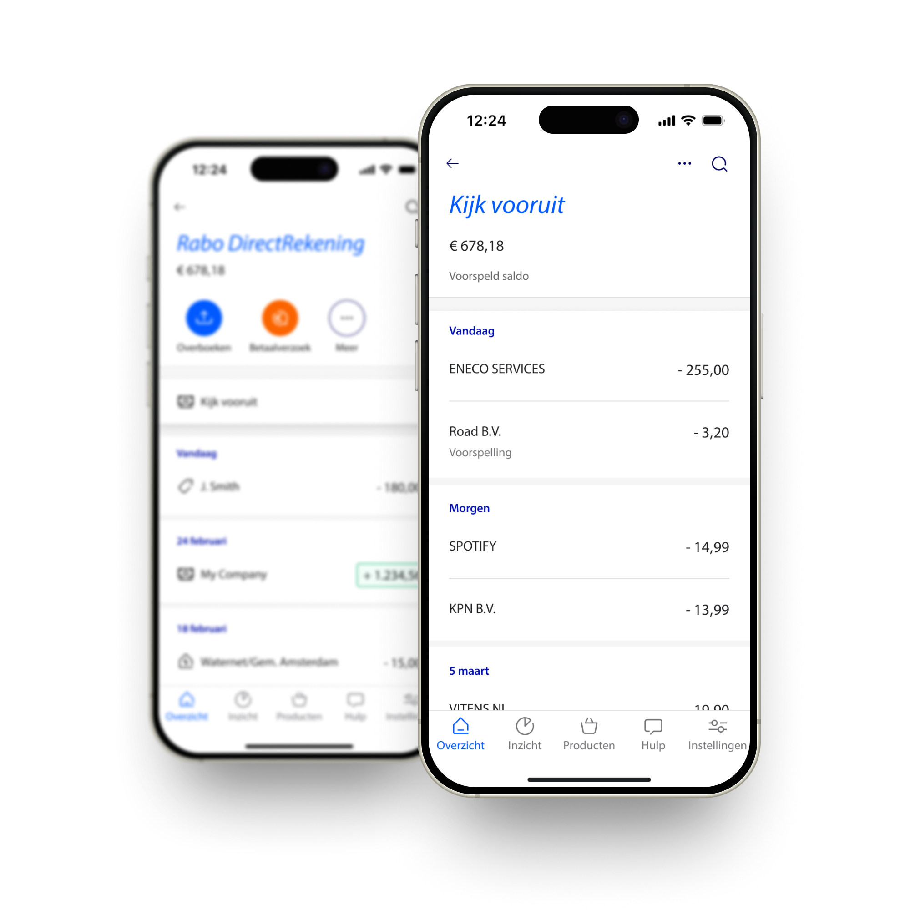

## About Rabobank
Rabobank, one of the leading banks in the Netherlands, processes about 4 billion customer transactions every year. Various complex transaction enrichment engines are in place to enrich these transactions with additional information, such as a category (groceries, energy, insurances, etc) or a periodicity indicator (weekly, monthly, etc).  Many use cases within the bank depend on these enrichments and typically have very demanding requirements when it comes to throughput and latency. One of the use cases is the Insights feature in the Rabobank app (see image below). This feature offers customers insights in their past ánd future spending behaviour. Insights provides an overview of their fixed costs and subscriptions (past and future), e.g., their (upcoming) energy bill, rent, streaming services, etc. A fundamental building block supporting Insights is the Periodicity engine. 



## Detecting periodic transaction patterns 

An especially demanding task is the (near realtime) detection of periodic patterns in payment transactions (weekly, monthly, etc). The main reason for this is that you need the complete historical sequence of transactions to establish the presence of 1 or more periodic patterns hidden among non-periodic outliers. This means that the amount of data processed daily is about 10-100 times more than the actual daily transactions. 

Let’s have a look at an example: In the table below you see 5 transactions from my account to Nintendo. Three of these transactions are actually the monthly membership fee, while the 2 others are for purchasing a new game. An approach to detect periodic patterns could be to find out which transactions belong together, and then assign a periodicity to each subgroup. In this case it would be a monthly sequence consisting of the 3 membership fee transactions, and a non-periodic sequence consisting of the 2 individual game purchases. 

| Date       	| account    	| counterparty 	| amount 	|
|------------	|------------	|--------------	|--------	|
| 27-01-2025 	| my account 	| Nintendo     	| 3,99   	|
| 03-02-2025 	| my account 	| Nintendo     	| 50,00  	|
| 27-02-2025 	| my account 	| Nintendo     	| 3,99   	|
| 13-03-2025 	| my account 	| Nintendo     	| 59,99  	|
| 27-03-2025 	| my account 	| Nintendo     	| 3,99   	|

This example can be extended to all customers and all counterparties, easily adding up to millions of small transaction groups. To meet performance requirements, and to keep computation time and cost at bay we realized we needed to expand our horizons and look beyond the mixture of pure Python and Pandas we typically use within the bank. Luckily, during Christmas last year we read some blogs about a new DataFrame library that promised blazingly fast performance: Polars.


## To 'Polars' or not to 'Polars'?
To find out if Polars could work for us, we wanted to answer 3 questions: 
- Does it fit our use case?
- Does it deliver on its (performance) promise?
- Is it mature enough to run in an enterprise level production environment?

After a small proof of concept (POC) -where we migrated a small core part of the codebase to Polars- we realized this could actually work… We managed to rewrite the code pretty quickly, the resulting code was impressively fast (~30x faster) and as a cherry on top it was also much more readable! 
The very active and fast growing community gave us and our architects enough confidence to go ahead and rewrite the entire codebase in Polars. 

Within about 2 months we managed to rewrite our entire codebase (~10k lines); which is pretty fast considering the majority of the team had zero prior knowledge on Polars. What helped substantially in learning Polars is its clear and consistent syntax that is familiar when you are used to writing PySpark code. The lack of a confusing (multi)index is a blessing as well. 

## All in on Polars!
Fairly quickly we realized that Polars works best if you do everything in Polars, no going back and forth between Python and Polars, no for loops, no small sub-DataFrames, just clean DataFrame operations. This did require a bit of a mind shift towards a more functional programming style where we see our entire application as a single large query that operates on DataFrame level instead of functions that operate on (small) groups of transactions. A huge help here was the superpower that is the ‘window’ function. 

## Gain superpowers: window functions
A window function basically allows you to apply a single operation on subgroups you define on your data. The naïve Python equivalent would be to extract small DataFrames, apply the same operation to each of those and stitch the DataFrames back together. Window functions are a perfect fit for our problem, where we want to apply the same logic to subgroups of transactions, where each subgroup is defined as all transactions between a customer and a counterparty (see the Nintendo example above).

In the Nintendo example, we could split the membership fee from the individual game purchases based on the amount. A simple approach could be to create 2 subgroups based on the median amount for all transactions between me and Nintendo. See the example below:
```python
    df_split_based_on_amount = df_transactions.with_columns(
        sequence_id=(
            (pl.col("booking_amount") > (pl.median("booking_amount") * 2)).rank("dense", descending=False)
        ).over("account_id", "counterparty_id")
        - 1,
    )
```
If we now want to apply the same logic to all account/counterparty pairs, we can simply add ‘.over(‘account’, ‘counterparty’), telling Polars to apply the same logic to all subgroups in a very efficient manner. In reality we apply far more complex splitting logic, but the same principle holds, a single .over() clause scales the same logic to all possible subgroups. 

## Putting it to the test!
To demonstrate how well Polars works for our use case I created an (extremely) simplified version of our Periodicity engine in Polars and Pandas and compared both solutions. The engine performs the following tasks on a set of input transactions:
- Determine subgroups of transactions based on the amount (see example above)
- Determine how likely a subgroup of transactions is to be monthly periodic (see example below)

```python
    df_res = df_transactions.with_columns(
        monthly=pl.col("date")
        .dt.date()
        .diff(null_behavior="ignore")
        .dt.total_days()
        .is_between(25, 35)
        .over("account_id", "counterparty_id", "sequence_id", order_by="date")
    ).with_columns(monthly_consistency_score=pl.mean("monthly").over("account_id", "counterparty_id", "sequence_id"))
    return df_res
  ```

The complete code can be found on my github: https://github.com/freerkvenhuizen/polars_rabobank_blog

Both solutions have been benchmarked on synthetic data ranging in size from 10 to 1M transactions. The results are shown in the table below:

| rows    	| Pandas  	| Polars 	| Improvement 	|
|---------	|---------	|--------	|-------------	|
| 10      	|  3.8 ms 	| 0.7 ms 	| 5.4x        	|
| 100     	| 5.6 ms  	| 0.9 ms 	| 6.2x        	|
| 1000    	| 19.3 ms 	| 2.1 ms 	| 9.2x        	|
| 10000   	| 153 ms  	| 9 ms   	| 17x         	|
| 100000  	| 1.5s    	| 83ms   	| 17.9x       	|
| 1000000 	| 15s     	| 944 ms 	| 15.8x       	|

Depending on the size of the dataset, an improvement ranging from 5 to 18x is observed for the toy version of our engine. In reality our production engine is far more complex which means that Polars optimization techniques like lazy evaluation, projection/predicate pushdown and subplan elimination have an even greater impact on performance than observed in this example. 

## Polars as enabler
For our use case this level of performance is the difference between meeting or not meeting requirements! In addition, it gives us headroom to add more complex logic to our engine and thereby increase statistical performance. It is therefore not only boosting technical performance, but also allows us to extend and improve the engine to better serve our consumers. 


### TEMPLATE
<div style="margin-top: 4em; display: flex; align-items: flex-start;">
  <div>
    <p style="border-left: 2px solid #ccc; padding-left: 1em;font-style: italic">
		<q>
		    TESTIMONIAL OR QUOTE ABOUT POLARS USAGE
		</q>
		<br><br>
		<b>NAME</a></b><br>
		TITLE @ COMPANY
	</p>
  </div>
</div>
